# Loople 🌿

## 📌 목차
[[1] 프로젝트 개요](#overview)  
[[2] 주요 기능](#main-feature)  
[[3] 프로젝트 구조](#structure)  
[[4] 기술 스택](#tech-stack)  
[[5] API 명세서](#api-specification)  
[[6] 팀원](#team)  
[[7] 실행](#run)  

---

<h2 id="overview">📌 프로젝트 개요</h2>

- **프로젝트명**: 루플(Loople)
- **프로젝트 기간**: 2025.07.09 ~ 2025.08.12
- **프로젝트 소개**:  
  순환과 사람 그리고 즐거움이 결합된 지속 가능한 순환의 삶을 돕는 플랫폼    
  퀴즈, 아바타 키우기 등의 재미있는 활동을 통해 지역과 사람을 잇고, 모두가 함께 순환의 가치를 만들어가는 공간입니다.

---

<h2 id="main-feature">📌 주요 기능</h2>  

### 회원가입 및 로그인(소셜로그인)
### 퀴즈
로그인 시 사용자에게 **퀴즈를 출제**한다.  
퀴즈 문제는 **매월 1일 00:00:00에 OpenAI API를 통해 한 달 치 문제가 자동으로 생성**된다.

### 게시판
공지사항, 자유 게시글, 중고 게시글을 확인할 수 있다.  
중고 게시글은 판매가 아닌 **나눔을 기반**으로 한다.  
  사용하지 않지만 **버리기 아까운 물건을 나눔**하는 것이 목적이다.  
사용자 지역 기반의 게시글과 전체 게시글을 **선택적으로 확인**할 수 있다.

### 챗봇
쓰레기 처리 요령을 챗봇 형식으로 간단하게 안내한다.  
지역별 수거 정보도 빠르게 확인 가능하다.  
추가 질문이 있는 경우, OpenAI API를 활용한 자유 질문/응답이 가능하다.

### 채팅
사용자 간 **1:1 실시간 채팅 기능**을 제공한다.  
특히 **중고 나눔 거래 시 소통 수단**으로 활용된다.

### 알림
### 지역별 규칙
챗봇 기능과 별도로 **더 상세한 쓰레기 분리수거 및 처리 규칙을 제공**한다.  
이 기능은 **전국 단위 정보를 바탕**으로 하며, 사용자 지역과 무관하게 조회할 수 있다.

### 마을
### 아바타 및 개인 아이템

---

<h2 id="structure">📌 프로젝트 구조</h2>

### FE
~~~plaintext
FRONTEND/
├── node_modules/
├── public/
├── src/
│   ├── apis/
│   ├── assets/
│   ├── components/
│   │   ├── atoms/
│   │   ├── common/
│   │   ├── modals/
│   │   ├── organisms/
│   │   ├── pages/
│   │   └── templates/
│   ├── constants/
│   ├── context/
│   ├── hooks/ 
│   ├── routes/
│   ├── services/
│   ├── store/
│   ├── styles/
│   ├── utils/
│   ├── App.jsx
│   └── main.jsx
├── .env
├── .gitignore
├── eslint.config.js
├── index.html
├── package-lock.json
├── package.json
├── README.md
├── uno.config.mjs
├── vite.config.js
└── yarn.lock
~~~
- `src/apis` : API 요청 관련 모듈
- `src/assets` : 이미지, 폰트 등 정적 자원
- `src/components` : UI 컴포넌트 모음 (atoms, modals, templates 등으로 분리)
- `src/constants` : 상수 정의 파일
- `src/context` : 전역 상태 관리를 위한 React Context
- `src/hooks` : 커스텀 훅 정의
- `src/routes` : 라우팅 관련 설정 파일
- `src/services` : 도메인별 서비스 로직
- `src/store` : 전역 상태관리 (예: Redux, Zustand 등)
- `src/styles` : 전역 스타일, 테마 등 스타일 정의
- `src/utils` : 공통 유틸리티 함수
- `src/App.jsx` : 전체 앱을 구성하는 루트 컴포넌트
- `src/main.jsx` : 앱 진입점, React 앱을 DOM에 마운트
- `index.html` : 앱의 HTML 템플릿
- `vite.config.js` : Vite 번들러 설정 파일
- `.env` : 환경변수 설정 파일
- `package.json` : 프로젝트 의존성과 스크립트 정의

### BE
~~~plaintext
backend/
├── .gradle/
├── .idea/
├── build/
├── gradle/
├── src/
│ ├── main/
│ │ ├── java/
│ │ │ └── com/loople/backend/
│ │ │ ├── v1/
│ │ │ └── v2/
│ │ │ ├── domain/
│ │ │ │ ├── auth/
│ │ │ │ ├── avatarItem/
│ │ │ │ ├── badgeCatalog/
│ │ │ │ ├── beopjeongdong/
│ │ │ │ ├── chat/
│ │ │ │ ├── community/
│ │ │ │ ├── loopingCatalog/
│ │ │ │ ├── myAvatar/
│ │ │ │ ├── myAvatarItem/
│ │ │ │ ├── myBadge/
│ │ │ │ ├── myLoopling/
│ │ │ │ ├── myRoom/
│ │ │ │ ├── myRoomItem/
│ │ │ │ ├── myVillage/
│ │ │ │ ├── quiz/
│ │ │ │ ├── regionalRule/
│ │ │ │ ├── roomItem/
│ │ │ │ ├── userNotification/
│ │ │ │ ├── users/
│ │ │ │ └── villageStatus/
│ │ │ └── global/
│ │ │ ├── api/
│ │ │ ├── config/
│ │ │ ├── exception/
│ │ │ ├── getUserId/
│ │ │ ├── jwt/
│ │ │ └── s3/
│ │ └── resources/
│ │ └── application.yml
│ └── test/
├── .gitattributes
├── .gitignore
├── build.gradle
├── gradlew
├── gradlew.bat
├── HELP.md
└── settings.gradle
~~~

- `src/main/java/com/loople/backend/v2/domain` : 도메인별 세부 모듈들 (auth, chat, community 등)
- `src/main/java/com/loople/backend/v2/global` : 공통 기능 (api, config, exception 등)
- `src/main/resources/application.yml` : 설정 파일
- `build.gradle`, `gradlew` 등 : Gradle 빌드 관련 파일

---

<h2 id="tech-stack">📌 기술 스택</h2>

### FE
      

### BE
    
  

### DB

### DEPLOY

### VCS
 

### COLLABORATION
 

---

<h2 id="api-specification">📌 API 명세서</h2>

### UserController
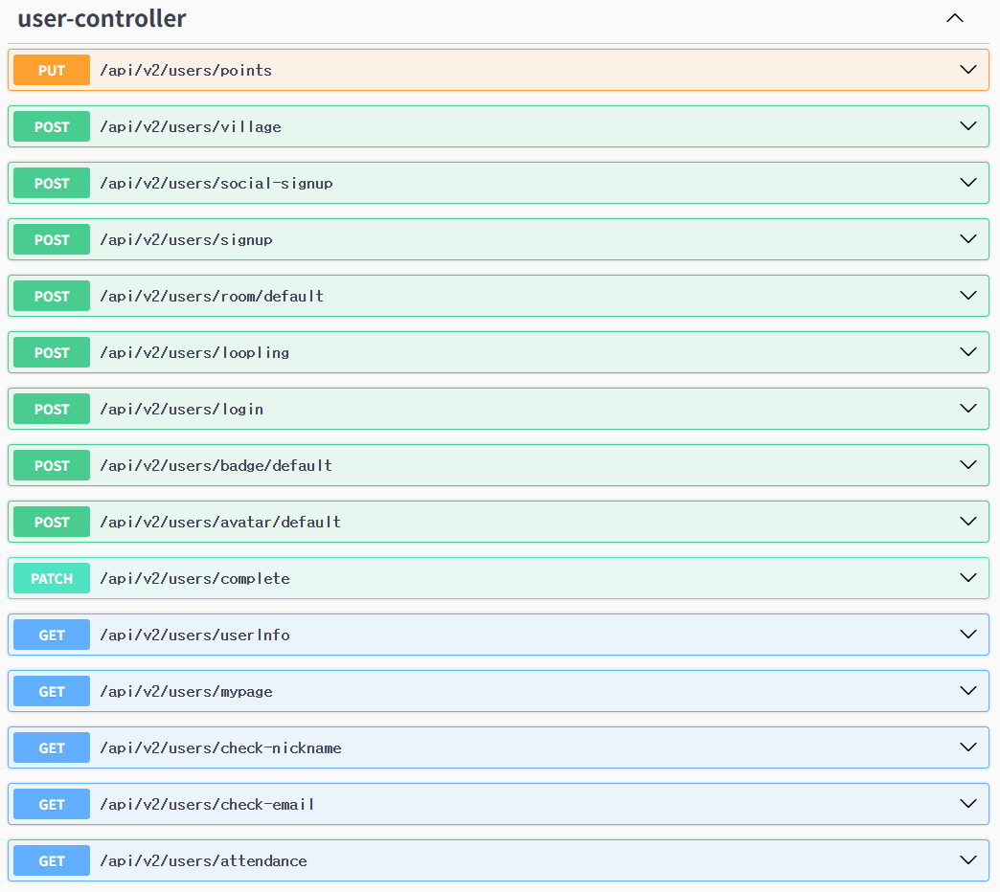
### RuleController
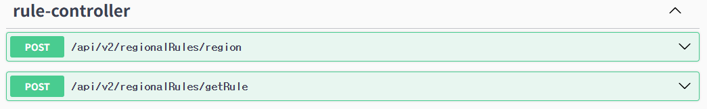
### QuizController
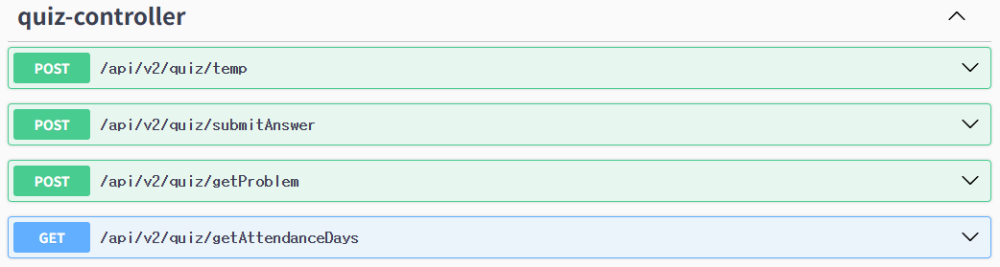
### OAuthController
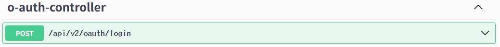
### MyRoomItemController
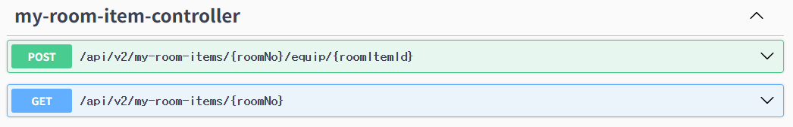
### MyLooplingController
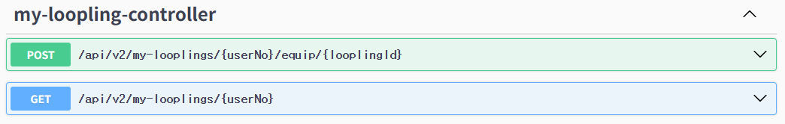
### MyBadgeController
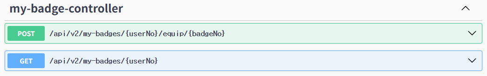
### CommunityController
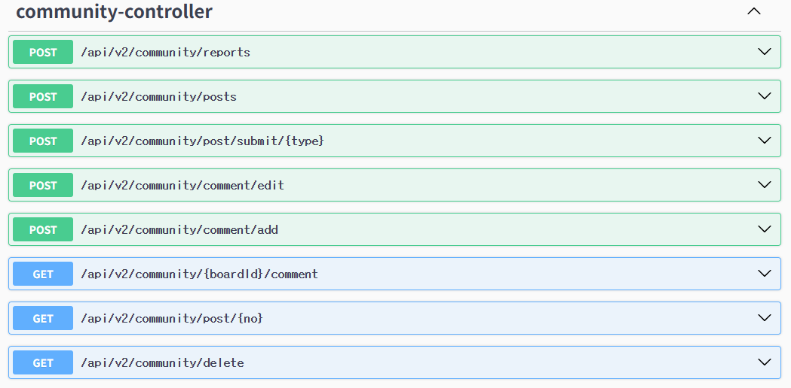
### ChatController
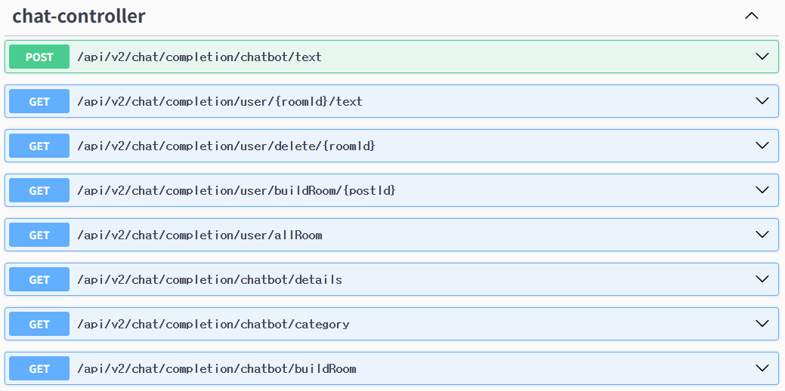
### S3Controller
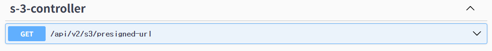
### RoomItemController
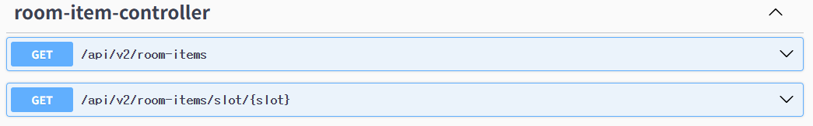
### MyRoomController
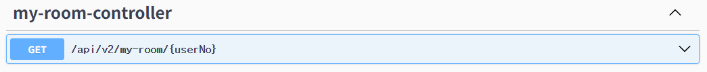
### LooplingCatalogController
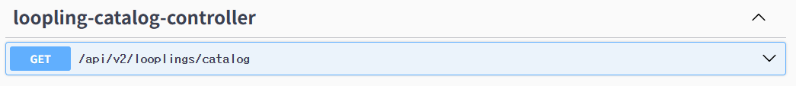
### BeopjeongdongController
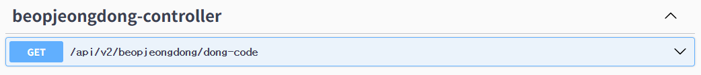
### BadgeCatalogController
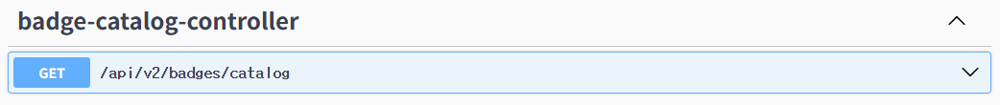

---

<h2 id="team">📌 팀원</h2>

|  이름  |  역할  |  GitHub  |  담당 기능 |
|--------|--------|----------|------------|
| 백진선 | FE, BE | blrlk | 퀴즈, 게시판, 챗봇, 채팅, 지역별 규칙 |
| 장민솔 | FE, BE | min5ol | 회원가입, 로그인(소셜로그인), 알림, 마을, 아바타 및 개인 아이템 |

---

<h2 id="run">📌 실행</h2>

### FE
  npm run dev
### BE
  ./gradlew bootrun
